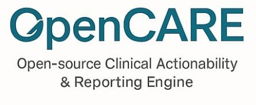

OpenCare: Open-Source Clinical Genomics Decision Support Platform

<p align="center">
  
</p>

Introduction

OpenCare is an open-source, vendor-agnostic clinical genomics decision support (CDS) tool.
It is designed to process next-generation sequencing (NGS) data across multiple clinical domains, integrate evidence from established knowledgebases, and generate clinician-oriented reports and structured outputs suitable for electronic medical record (EMR) integration.

The tool emphasizes reproducibility, transparency, and institutional adaptability. It supports both research and clinical contexts.

## Features

Cross-domain applicability

Oncology: somatic and germline variant tiering (AMP/ESMO/ESCAT guidelines).

Pharmacogenomics: drug–gene interaction and dose adjustment (CPIC, PharmGKB).

Inherited disease: ACMG/ClinGen classification framework.

Infectious disease: pathogen typing and antimicrobial resistance prediction (CARD, ResFinder).

Standards-based reporting

Human-readable HTML reports designed for tumor boards and clinical decision meetings.

Structured outputs conforming to HL7 FHIR Genomics and mCODE implementation guides.

Institutional customization

Configurable thresholds for variant calling, local drug availability, and reporting cut-offs.

## Workflow


## Demo Video
▶️ Watch the demo here: [Demo Video on YouTube](https://www.youtube.com/watch?v=jQRYuFybSV4)
[](https://www.youtube.com/watch?v=jQRYuFybSV4)


<p align="center">
  <a href="https://www.youtube.com/watch?v=jQRYuFybSV4" target="_blank" rel="noopener noreferrer" aria-label="Watch the demo on YouTube">
    <picture>
      <source srcset="https://i.ytimg.com/vi_webp/jQRYuFybSV4/maxresdefault.webp" type="image/webp">
      <source srcset="https://i.ytimg.com/vi_webp/jQRYuFybSV4/hqdefault.webp" type="image/webp">
      <source srcset="https://img.youtube.com/vi/jQRYuFybSV4/maxresdefault.jpg" type="image/jpeg">
      
    </picture>
  </a>
</p>


## Demo

🔗 [OpenCARE Demo (HTML)](https://ahmedhassan-bioinfo.github.io/OpenCare/OpenCARE_demo.html)


## Reproducibility

Built on Nextflow DSL2 for portability and scalability.

Containerized execution (Docker/Singularity/Podman).

Compatible with HPC and cloud environments.

Open-source and extensible

Modular design allows integration of new variant callers, annotation sources, or reporting templates.

## Project Structure
<pre> OpenCare_project/
├── workflows/        # Nextflow main.nf and workflow definitions
├── modules/          # Modular processes (alignment, variant calling, annotation, reporting)
├── config/           # Configuration profiles (resources, Docker/Singularity, HPC settings)
├── references/       # Reference genomes, annotations, knowledgebase snapshots
├── test_data/        # Toy FASTQ/VCF datasets for validation
├── results/          # Output directory (reports, VCFs, BAMs, FHIR bundles)
├── OC_work/          # Project-specific Nextflow work directory
├── logs/             # Execution logs and traces
└── docs/             # Documentation, protocols, and references </pre>

## Installation
Requirements

Nextflow ≥23

Java 11 or 17

Docker
 or Singularity

Access to relevant reference data (e.g., GRCh38, GTF, gnomAD, ClinVar)

## Setup
```bash
git clone https://github.com/AhmedHassan-bioinfo/OpenCare
cd OpenCare
```
## Usage (works for any sample)

> **Tip:** Nextflow groups read pairs by the shared prefix before `{1,2}` (or `_R{1,2}`), so keep your files named like `SAMPLE_1.fastq.gz` / `SAMPLE_2.fastq.gz` or `SAMPLE_R1.fastq.gz` / `SAMPLE_R2.fastq.gz`.

### Whole-Genome Sequencing (Tumor/Normal)

**Single sample (replace placeholders):**

nextflow run workflows/main.nf \
  --reads   'data/wgs/tumor/<TUMOR_ID>_{1,2}.fastq.gz' \
  --normal  'data/wgs/normal/<NORMAL_ID>_{1,2}.fastq.gz' \
  --ref_fa  references/hg38.fa \
  --sample  <CASE_ID> \
  --outdir  results/<CASE_ID> \
  -profile docker

Pharmacogenomics (PGx) Panel
nextflow run workflows/main.nf \
  --vcf 'data/pgx/<SAMPLE_ID>.vcf.gz' \
  --pgx true \
  --outdir results/pgx_case \
  -profile docker

Infectious Disease (Pathogen Resistance)
nextflow run workflows/main.nf \
  --reads 'data/microbes/<SAMPLE_ID>_{1,2}.fastq.gz' \
  --ref_fa references/<SPECIES>.fa \
  --sample  <SAMPLE_ID> \
  --outdir  results/microbes/<SAMPLE_ID> \
  -profile docker

## Outputs

Reports

HTML interactive reports summarizing clinically relevant variants.

Structured Data

HL7 FHIR Genomics and mCODE JSON bundles for EMR integration.

Intermediate Files

BAM files, VCFs, QC metrics, and log files for auditing and validation.

Execution Metadata

Nextflow trace files, resource usage, and provenance records.

Tumour board file for tumor board discussions.

## Data Sources

Oncology: CIViC, OncoKB (research license), ClinVar, ClinGen

Pharmacogenomics: PharmGKB, CPIC guidelines

Inherited disease: ClinVar, ACMG/AMP classification criteria

Pathogen resistance: CARD, ResFinder

Population references: gnomAD, 1000 Genomes, TCGA, GENIE

## Future Validation and Benchmarking

Cross-validation against retrospective clinical cohorts (~200 cases).

Concordance assessment with vendor pipelines (e.g., Qiagen QCI, Illumina Connected Insights, SOPHiA DDM).

EMR integration validated with FHIR Genomics Implementation Guide validators.

Performance metrics: precision, recall, concordance for Tier I/II oncology calls, PGx phenotypes, and infectious resistance predictions.

## Limitations

Knowledgebase coverage varies across disease areas.

Panel/WES/WGS harmonization requires calibration for TMB/MSI.

CHIP artifacts may confound liquid biopsy results; recommended filtering strategies are provided.

Institutional customization is necessary for clinical deployment.

## Roadmap

Integration of machine-learning classifiers .

Automated clinical trial matching via ClinicalTrials.gov.

Extension to multi-omics integration (RNA-seq, proteomics, methylation).

### Disclaimers
- All dates are targets; scope may shift if validation fails quality gates.


## Contributing

Contributions are welcome. Please see the CONTRIBUTING.md
 for coding standards, module templates, and review process.

## License

This project is licensed under the Apache License 2.0
.

## Citation

If you use OpenCare in your work, please cite:

Ahmed Hassan  
OpenCare: An Open-Source, Vendor-Agnostic Clinical Genomics Decision Support Platform.
GitHub Repository, 2025.
