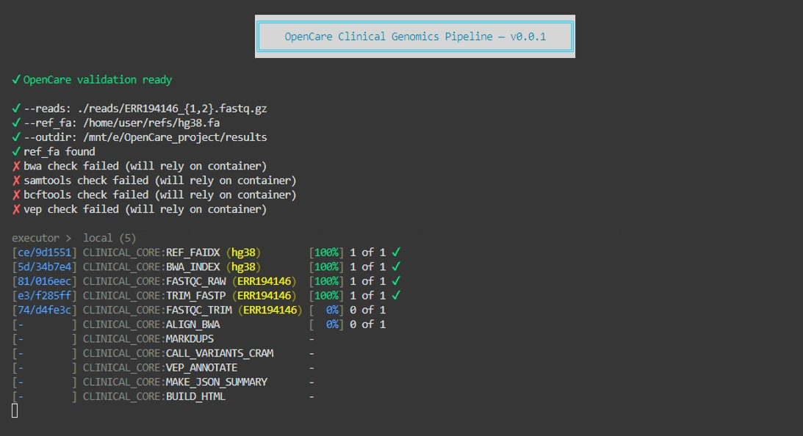

OpenCare: Open-Source Clinical Genomics Decision Support Platform

<p align="center">
  
</p>

Introduction

OpenCare is an open-source, vendor-agnostic clinical genomics decision support (CDS) tool.
It is designed to process next-generation sequencing (NGS) data across multiple clinical domains, integrate evidence from established knowledgebases, and generate clinician-oriented reports and structured outputs suitable for electronic medical record (EMR) integration.

The tool emphasizes reproducibility, transparency, and institutional adaptability. It supports both research and clinical contexts.


## Features

### Cross-domain applicability
- **Oncology:** somatic & germline variant tiering (AMP/ESMO/ESCAT).
- **Pharmacogenomics:** drug–gene interactions and dosing (CPIC, PharmGKB).
- **Inherited disease:** ACMG/ClinGen classification framework.
- **Infectious disease:** pathogen typing & AMR prediction (CARD, ResFinder).

### Standards-based reporting
- Human-readable **interactive HTML** reports for tumor boards.
- Structured outputs: **HL7 FHIR Genomics** and **mCODE** JSON bundles.

### Institutional customization
- Configurable thresholds for variant calling, reporting cut-offs, and local drug availability.


## Workflow


## Prototype Video
▶️ Watch the prototype here: [Demo Video on YouTube](https://www.youtube.com/watch?v=jQRYuFybSV4)


<p align="center">
  <a href="https://www.youtube.com/watch?v=jQRYuFybSV4" target="_blank" rel="noopener noreferrer" aria-label="Watch the demo on YouTube">
    <picture>
      <source srcset="https://i.ytimg.com/vi_webp/jQRYuFybSV4/maxresdefault.webp" type="image/webp">
      <source srcset="https://i.ytimg.com/vi_webp/jQRYuFybSV4/hqdefault.webp" type="image/webp">
      <source srcset="https://img.youtube.com/vi/jQRYuFybSV4/maxresdefault.jpg" type="image/jpeg">
      
    </picture>
  </a>
</p>


## Give it a try

🔗 [OpenCARE Demo (HTML)](https://ahmedhassan-bioinfo.github.io/OpenCare/OpenCARE_demo.html)


## Real work snapshot



## Reproducibility
- Built on **Nextflow DSL2** for portability and scalability.
- **Containerized** execution (Docker/Singularity/Podman).
- Compatible with HPC and cloud.

## Open-source and extensible
- Modular design for swapping in new callers, annotations, or reporting templates.

  
## Project Structure
<pre> OpenCare_project/
├── workflows/ # DSL2 workflows (clinical_core.nf, etc.)
├── modules/ # Processes (alignment, calling, VEP, reporting)
├── config/ # Profiles and resource settings
├── references/ # Reference genomes, annotations, KB snapshots
├── test_data/ # Toy FASTQ/VCF for validation
├── results/ # Reports, VCFs, BAMs, FHIR/mCODE bundles
├── work/ # Nextflow work directory (on Linux FS)
├── logs/ # Execution logs and traces
└── docs/ # Documentation and protocols
</pre>


> **WSL2/Windows note:** keep **project, `work/`, and `results/` on Linux (ext4)** for locking and performance. Treat `E:`/`D:` mounts as read-only inputs whenever possible.

## Installation
  
**Requirements**
- Nextflow ≥ 23
- Java 11 or 17
- Docker (or Singularity)
- Access to reference data (e.g., GRCh38, GTF, gnomAD, ClinVar)
- Optional: VEP cache for offline annotation


## Setup
```bash
git clone https://github.com/AhmedHassan-bioinfo/OpenCare
cd OpenCare
```

  
##Configuration (important on WSL2/Windows)
Set the Nextflow work dir to Linux FS:
```bash
nextflow run workflows/clinical_core.nf -w "$HOME/nxf_work"  -profile docker
```
Use a Linux path for outputs, e.g. --outdir "$HOME/OpenCare_out".

If inputs live on Windows mounts (e.g., /mnt/e/...), use them as read-only. Avoid publishing to /mnt/e to prevent I/O/file-lock errors.

Stage-in is configured to use symlinks (or copy) to avoid cross-device hard-link issues.

VEP cache inside Docker

Bind your cache read-only (example):
```bash
docker.runOptions = '-v /mnt/d/vep_cache:/vep_cache:ro --tmpfs /tmp:exec'
params.vep_cache  = '/vep_cache'
```


  
## Usage (works for any sample)

> **Tip:** Nextflow groups read pairs by the shared prefix before `{1,2}` (or `_R{1,2}`), so keep your files named like `SAMPLE_1.fastq.gz` / `SAMPLE_2.fastq.gz` or `SAMPLE_R1.fastq.gz` / `SAMPLE_R2.fastq.gz`.

### Whole-Genome Sequencing 

**Tumor-only WGS (single sample) (replace placeholders):**

nextflow run workflows/clinical_core.nf \
  --reads  '/path/to/tumor/<SAMPLE_ID>_{1,2}.fastq.gz' \
  --ref_fa '/path/to/refs/hg38.fa' \
  --outdir "$HOME/OpenCare_out/<SAMPLE_ID>" \
  -w "$HOME/nxf_work" \
  -profile docker

(WIP)
Pharmacogenomics (PGx) VCF
nextflow run workflows/clinical_core.nf \
  --vcf '/path/to/pgx/<SAMPLE_ID>.vcf.gz' \
  --pgx true \
  --outdir "$HOME/OpenCare_out/pgx_<SAMPLE_ID>" \
  -w "$HOME/nxf_work" \
  -profile docker

(Planned)
Infectious Disease (Pathogen Resistance)
nextflow run workflows/clinical_core.nf \
  --reads  '/path/to/microbes/<SAMPLE_ID>_{1,2}.fastq.gz' \
  --ref_fa '/path/to/microbes/<SPECIES>.fa' \
  --outdir "$HOME/OpenCare_out/micro_<SAMPLE_ID>" \
  -w "$HOME/nxf_work" \
  -profile docker


## Outputs

Reports: interactive HTML (variant table, filters, clickable evidence).

Structured data: HL7 FHIR Genomics + mCODE JSON bundles.

Intermediate files: BAM/BAI, (VEP-)VCF/VCF.TBI, QC metrics.

Execution metadata: Nextflow traces, logs, provenance.

    

## Data Sources

Oncology: CIViC, OncoKB (research license), ClinVar, ClinGen

Pharmacogenomics: PharmGKB, CPIC

Inherited disease: ClinVar, ACMG/AMP criteria

Pathogen resistance: CARD, ResFinder

Population refs: gnomAD, 1000 Genomes, TCGA, GENIE

    

## Validation & Benchmarking (planned)

Cross-validation on retrospective cohorts (~200 cases).

Concordance vs. vendor pipelines (Qiagen QCI, Illumina CI, SOPHiA DDM).

EMR integration checks with FHIR Genomics validators.

Metrics: precision/recall, concordance for Tier I/II oncology, PGx phenotypes, AMR.

    
## Limitations

Knowledgebase coverage varies by disease area.

Harmonizing panel/WES/WGS requires calibration (e.g., TMB/MSI).

CHIP can confound liquid biopsy; filtering strategies recommended.

Institutional customization required for clinical deployment.

## Roadmap

ML classifiers for prioritization.

ClinicalTrials.gov trial matching.

Multi-omics extensions (RNA-seq, proteomics, methylation).

### Disclaimers
- All dates are targets; scope may shift if validation fails quality gates.


## Contributing
Contributions welcome—see CONTRIBUTING.md for coding standards and review.

## License
Apache License 2.0

## Citation

If you use OpenCare in your work, please cite:

Ahmed Hassan. OpenCare: An Open-Source, Vendor-Agnostic Clinical Genomics Decision Support Platform. GitHub Repository, 2025.
