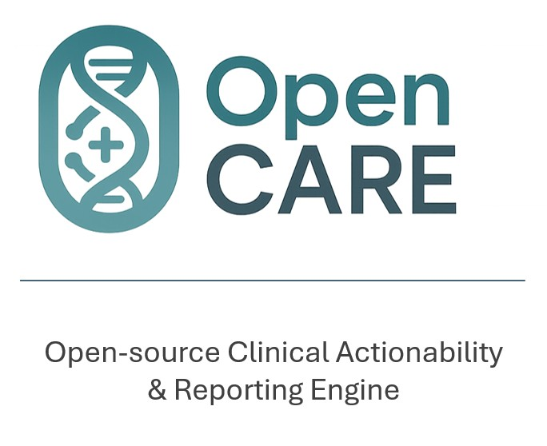

# OpenCare: Open-Source Clinical Genomics Decision Support

<p align="center">
  
</p>

OpenCare is an open-source, vendor-agnostic clinical genomics decision support (CDS) platform. It processes NGS data, integrates evidence from established knowledgebases, and produces clinician-oriented HTML reports plus structured outputs suitable for EMR integration (FHIR Genomics / mCODE).

**Design goals:** reproducibility, transparency, portability (HPC, cloud, WSL2), and institutional adaptability for both research and clinical prototyping.

---

## Features

### Cross-domain applicability

* **Oncology:** somatic & germline variant triage (AMP/ESMO/ESCAT-style).
* **Pharmacogenomics:** drug–gene guidance (CPIC/PharmGKB).
* **Inherited disease:** ACMG/ClinGen-oriented summarization.
* **Infectious disease (planned):** typing & AMR prediction (CARD/ResFinder).

### Standards-based reporting

* Interactive **HTML** report for tumor boards.
* Structured outputs: **HL7 FHIR Genomics** and **mCODE** JSON bundles.

### Institutional customization

* Tunable reporting thresholds, filters, knowledge sources, and local drug formularies.

### Reproducibility & scale

* **Nextflow DSL2**, **containerized** execution (Docker/Podman/Singularity).
* Runs on laptops, HPC, cloud, and **WSL2** (Windows).

---

## Workflow


## Prototype Video

▶️ Watch the prototype: [Demo Video on YouTube](https://www.youtube.com/watch?v=jQRYuFybSV4)

<p align="center">
  <a href="https://www.youtube.com/watch?v=jQRYuFybSV4" target="_blank" rel="noopener noreferrer" aria-label="Watch the demo on YouTube">
    <picture>
      <source srcset="https://i.ytimg.com/vi_webp/jQRYuFybSV4/maxresdefault.webp" type="image/webp">
      <source srcset="https://i.ytimg.com/vi_webp/jQRYuFybSV4/hqdefault.webp" type="image/webp">
      <source srcset="https://img.youtube.com/vi/jQRYuFybSV4/maxresdefault.jpg" type="image/jpeg">
      
    </picture>
  </a>
</p>

## Live Demos

* 🔗 **OpenCARE Demo (HTML):** [https://ahmedhassan-bioinfo.github.io/OpenCare/OpenCARE\_demo.html](https://ahmedhassan-bioinfo.github.io/OpenCare/OpenCARE_demo.html)
* 🔗 **Real Sample Prototype (HTML):** [https://ahmedhassan-bioinfo.github.io/OpenCare/OpenCare\_ERR194146\_report.html](https://ahmedhassan-bioinfo.github.io/OpenCare/OpenCare_ERR194146_report.html)
  *(Core functionality is operational; more features are under active development.)*

---

## Install

**Requirements**

* Nextflow ≥ 23
* Java 11 or 17
* Docker (or Podman/Singularity)
* Access to reference data (e.g., **GRCh38** FASTA + FAI; BWA index auto-built)
* Optional: **VEP cache** for offline annotation
* Optional: **Graphviz** (for DAG rendering)

```bash
git clone https://github.com/AhmedHassan-bioinfo/OpenCare
cd OpenCare
```

> **WSL2/Windows note:** keep **the repo, `work/`, and `results/` on Linux (ext4)** for file locking and performance. Treat `/mnt/e` or `/mnt/d` as **read-only inputs** when possible.

---

## Quick start

### Minimal single-sample run (WES/WGS tumor-only)

```bash
nextflow run main.nf \
  --reads  "$HOME/OpenCare/reads/<SAMPLE_ID>_R{1,2}.fastq.gz" \
  --ref_fa "/path/to/refs/hg38.fa" \
  --outdir "$HOME/OpenCare_out/<SAMPLE_ID>" \
  -w "$HOME/nxf_work" \
  -with-docker -resume
```

### Tumor/Normal paired exome (Mutect2 path)

```bash
nextflow run main.nf \
  --reads  "$HOME/OpenCare/reads/Exome_*/*_R{1,2}.fastq.gz" \
  --ref_fa "/path/to/refs/hg38.fa" \
  --tumor_id  "Exome_Tumor" \
  --normal_id "Exome_Norm" \
  --patient_id P01 \
  --outdir "$HOME/OpenCare_out/P01" \
  -w "$HOME/nxf_work" \
  -with-docker -resume
```

> **Read pairing & sample IDs:** Nextflow groups `*_R{1,2}.fastq.gz` (or `{1,2}.fastq.gz`). For tumor/normal, set `--tumor_id` and `--normal_id` to **the exact sample IDs** (the `sid` emitted by read grouping).

### Optional: VEP annotation (offline cache inside Docker)

```bash
# nextflow.config (example)
docker.runOptions = '-v /mnt/d/vep_cache:/vep_cache:ro --tmpfs /tmp:exec'

# run
nextflow run main.nf \
  --reads  "$HOME/OpenCare/reads/<SAMPLE_ID>_R{1,2}.fastq.gz" \
  --ref_fa "/refs/hg38.fa" \
  --vep_cache "/vep_cache" \
  --outdir "$HOME/OpenCare_out/<SAMPLE_ID>" \
  -w "$HOME/nxf_work" \
  -with-docker -resume
```

### Optional: Panel QC (mosdepth) and pathway overlays

```bash
nextflow run main.nf \
  --reads "$HOME/OpenCare/reads/<SAMPLE_ID>_R{1,2}.fastq.gz" \
  --ref_fa "/refs/hg38.fa" \
  --panel_bed "/refs/panel_targets.bed" \
  --pathway_db "$PWD/resources/pathway_gene_map_v1.json" \
  --gene_domains "$PWD/resources/gene_domains.json" \
  --outdir "$HOME/OpenCare_out/<SAMPLE_ID>" \
  -w "$HOME/nxf_work" \
  -with-docker -resume
```

---

## Outputs

* **Interactive HTML:** `results/<SAMPLE_ID>/OpenCare_<SAMPLE_ID>_report.html`
* **Structured JSON:**

  * Slim report JSON (drives HTML)
  * Full report JSON
  * **mCODE** bundle JSON
* **VCF/CRAM/QC:**

  * (VEP-)VCF + index
  * Sorted/mark-dup CRAM + CRAI
  * FastQC/fastp summaries, mosdepth panel QC (if `--panel_bed`)
* **Execution metadata:** Nextflow trace, .log, timeline, provenance

---

## Configuration tips (especially WSL2)

* Use Linux paths for `-w` and `--outdir`:

  ```bash
  -w "$HOME/nxf_work"  --outdir "$HOME/OpenCare_out"
  ```
* Inputs on `/mnt/e` or `/mnt/d` are fine as **read-only**. Avoid writing results to Windows mounts to prevent I/O and locking errors.
* Stage-in uses symlink (or copy) modes to avoid cross-device hard-link issues.

---

## Common parameters (cheat sheet)

| Param                                      | Purpose                                            | Example                     |         |
| ------------------------------------------ | -------------------------------------------------- | --------------------------- | ------- |
| `--reads`                                  | FASTQ glob with R1/R2 brace expansion              | `reads/S1_R{1,2}.fastq.gz`  |         |
| `--ref_fa`                                 | Reference FASTA (FAI auto-generated)               | `/refs/hg38.fa`             |         |
| `--tumor_id`, `--normal_id`                | Enable TN path with Mutect2                        | `Exome_Tumor`, `Exome_Norm` |         |
| `--vep_cache`                              | Enable VEP offline cache                           | `/vep_cache`                |         |
| `--panel_bed`                              | Panel regions for mosdepth QC and targeted calling | `/refs/panel_targets.bed`   |         |
| `--patient_id`                             | Patient identifier embedded in JSON/mCODE          | `P01`                       |         |
| `--assay`                                  | Label: `panel`, `wes`, `wgs`                       | `wes`                       |         |
| `--knowledge_tsv`                          | Local knowledge snippets (optional)                | `kb_global_template.tsv`    |         |
| `--pathway_db`, `--gene_domains`           | JSON overlays for HTML                             | `resources/*.json`          |         |
| `--report_use_csq`                         | Filter HTML VCF by CSQ regex                       | \`true                      | false\` |
| `--report_keep_impact`                     | Keep impacts (CSV)                                 | `HIGH,MODERATE`             |         |
| `--enable_evidence`                        | Try online enrichment (CIViC/heuristics)           | \`true                      | false\` |
| `--region` / `--targets_bed`               | Restrict bcftools calling                          | `chr7:55M-56M` / BED        |         |
| `--max_cpus`, `--max_mem`, `--bwa_threads` | Resource knobs                                     | `8`, `24 GB`, `4`           |         |

> **OncoKB:** set `ONCOKB_TOKEN` in the environment to enable OncoKB calls where applicable.

---

## Project structure (top-level)

```
OpenCare/
├── main.nf                 # Clinical core workflow (DSL2)
├── HTML/
│   └── build_html.py       # HTML builder
├── resources/
│   ├── pathway_gene_map_v1.json
│   └── gene_domains.json
├── assets/                 # Logos, diagrams, screenshots
├── results/                # Default publish dir (configurable)
├── work/                   # Nextflow work dir (recommend on ext4)
└── test_data/              # Small validation datasets (optional)
```

> **Note:** Graphviz is optional; install to render DAG (`-with-dag`).

---

## Troubleshooting

* **“Invalid method invocation `call` … on \_closureXX”**
  Happens when a Channel/closure is mistakenly called like a function. The workflow in this repo already wires **paired TN** (`CALL_SOMATIC_MUTECT2`) vs **single-sample** (`CALL_VARIANTS_CRAM`) correctly and passes emitted channels to downstream steps.
* **WSL2 locking / cross-device link issues**
  Keep `-w` and `--outdir` under Linux home (ext4). Treat `/mnt/e` inputs as read-only.
* **Missing `--reads` / `--ref_fa`**
  Both are required for sequencing input mode; provide valid Linux paths.

---

## Data sources (by domain)

* **Oncology:** CIViC, OncoKB (research license), ClinVar, ClinGen
* **Pharmacogenomics:** PharmGKB, CPIC
* **Inherited disease:** ClinVar, ACMG/AMP oriented heuristics
* **Pathogen resistance:** CARD, ResFinder (planned)
* **Population/aux:** gnomAD, 1KG, TCGA/GENIE (as available)

---

## Validation & Benchmarking (planned)

* Retrospective cohorts (\~200 cases), concordance vs. vendor pipelines (QCI, CI, SOPHiA).
* EMR integration checks via FHIR Genomics validators.
* Metrics: precision/recall, Tier I/II concordance, PGx phenotypes, AMR accuracy.

## Limitations

* Knowledgebase coverage varies by indication.
* Harmonization across panel/WES/WGS needs calibration (e.g., TMB/MSI).
* CHIP may confound ctDNA; consider orthogonal filters.
* Institutional customization required for clinical deployment.

## Roadmap

* ML ranking/prioritization.
* ClinicalTrials.gov trial matching.
* Multi-omics (RNA-seq, proteomics, methylation).

---

## Contributing

Contributions welcome—see `CONTRIBUTING.md` for coding style, review, and issue labels.

## License

Apache License 2.0

## Citation

If you use OpenCare in your work, please cite:

> Ahmed Hassan. **OpenCare: An Open-Source, Vendor-Agnostic Clinical Genomics Decision Support Platform.** GitHub Repository, 2025.
